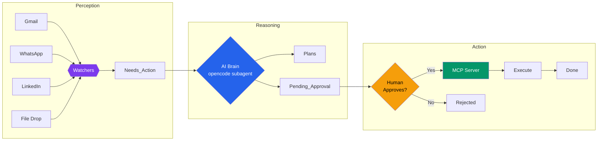
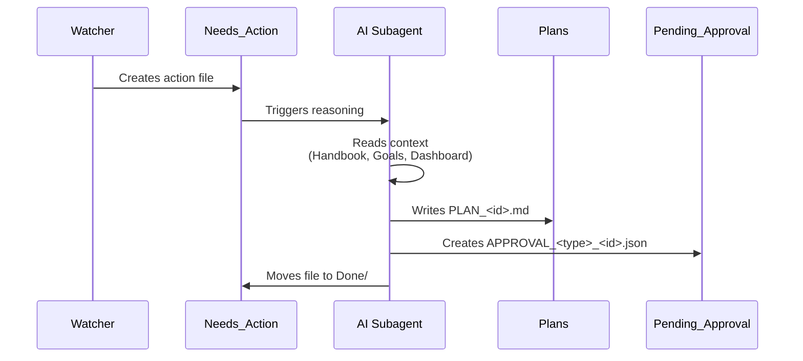
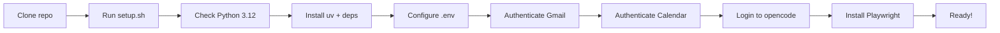
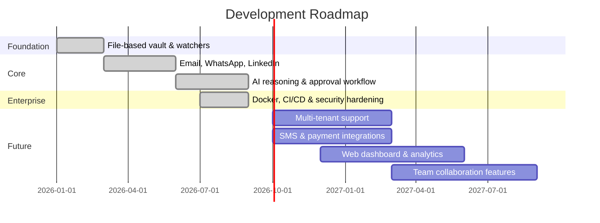

<p align="center">
  <picture>
    <source media="(prefers-color-scheme: dark)" srcset="https://img.shields.io/badge/AI_Digital_Employee-7C3AED?style=for-the-badge&logo=openai&logoColor=white">
    
  </picture>
</p>

<p align="center">
  <b>Autonomous enterprise agent — monitors communication channels, reasons with AI, and executes actions with human approval.</b>
</p>

<p align="center">
  <a href="https://www.python.org/downloads/release/python-312/"></a>
  <a href="https://github.com/Alihamza400/AI_Digital_Employee/actions/workflows/ci.yml"></a>
  <a href="https://www.docker.com"></a>
  <a href="https://opencode.ai"></a>
  <a href="LICENSE"></a>
  <a href="https://github.com/Alihamza400/AI_Digital_Employee"></a>
</p>

<p align="center">
  <a href="#overview">Overview</a> •
  <a href="#architecture">Architecture</a> •
  <a href="#capabilities">Capabilities</a> •
  <a href="#tech-stack">Tech Stack</a> •
  <a href="#quick-start">Quick Start</a> •
  <a href="#security">Security</a> •
  <a href="#roadmap">Roadmap</a>
</p>

<br>

---

## Overview

AI Digital Employee is a **production-grade autonomous agent** that follows the **Perception → Reasoning → Action** cycle. It monitors your communication channels, uses an LLM-powered brain to plan and decide, and executes approved actions — all with **human-in-the-loop oversight**.



---

## Architecture

The system is composed of four layers, each independently deployable and testable.

### Layer 1: Perception — Multi-Channel Watchers

Six watchers continuously monitor for incoming signals:

| Watcher | Channel | Technology | Trigger |
|---|---|---|---|
| `GmailWatcher` | Email | Gmail API (OAuth 2.0) | Polls unread mail |
| `WhatsAppWatcher` | Messaging | Playwright browser automation | Polls WhatsApp Web |
| `LinkedInWatcher` | Professional | Playwright + Jinja2 templates | Polls notifications |
| `FileSystemWatcher` | Files | watchdog (inotify) | File system events |
| `AIReasoningWatcher` | Internal | Subprocess `opencode run` | New action files |
| `ApprovalWatcher` | Approval | File rename watcher | Approved/Rejected signals |

The four pollers (`FileSystemWatcher`, `GmailWatcher`, `WhatsAppWatcher`, `LinkedInWatcher`)
extend `BaseWatcher` — a common abstract base class with `check_for_updates()` and
`create_action_file()`. `AIReasoningWatcher` and `ApprovalWatcher` are standalone
long-running event loops rather than pollers.

### Layer 2: Reasoning — AI Brain

When an action file appears in `Needs_Action/`, the `@ai-employee` opencode subagent:

1. Reads the action request
2. Consults **Company Handbook**, **Business Goals**, and live **Dashboard** for context
3. Generates a detailed execution plan → `Plans/PLAN_<id>.md`
4. Creates a structured approval request → `Pending_Approval/APPROVAL_<type>_<id>.json`
5. Archives the processed request → `Needs_Action/Done/`



### Layer 3: Action — MCP Server

Executes approved actions via the Model Context Protocol:

| Category | Tools | Integration |
|---|---|---|
| **Communication** | `SEND_EMAIL`, `CREATE_DRAFT` | Gmail API |
| **Messaging** | `SEND_WHATSAPP` | WhatsApp Web (Playwright) |
| **Social** | `POST_LINKEDIN`, `CREATE_DRAFT_LINKEDIN` | LinkedIn (Playwright + Jinja2) |
| **Productivity** | `SCHEDULE_MEETING` | Google Calendar API |
| **Documents** | `CREATE_INVOICE` | PDF generation (fpdf2) |
| **Operations** | `FILE_OPERATION`, `CREATE_TASK` | Local file system |
| **Research** | `WEB_SEARCH` | DuckDuckGo (Playwright) |

### Layer 4: Memory — Obsidian Vault

All state is stored in an **Obsidian-compatible Markdown vault** — no database required:

```
AI_Employee_Vault/
├── Company_Handbook.md    # Business rules & identity
├── Business_Goals.md      # Strategic objectives
├── Dashboard.md           # Live metrics (auto-updated)
├── Plans/                 # AI-generated plans
├── Pending_Approval/      # Awaiting human decision
├── Approved/              # Approved & executed
├── Rejected/              # Declined actions
├── Logs/                  # Daily activity logs
└── LinkedIn_Templates/    # Message templates
```

---

## Capabilities

<table>
  <tr>
    <td width="50%">
      <h3>📧 Email Automation</h3>
      <ul>
        <li>Monitors Gmail for important messages</li>
        <li>AI-generated replies with context</li>
        <li>Draft creation for review</li>
        <li>Human approval before send</li>
      </ul>
    </td>
    <td width="50%">
      <h3>💬 WhatsApp Integration</h3>
      <ul>
        <li>Browser automation via Playwright</li>
        <li>Persistent session management</li>
        <li>AI-crafted responses</li>
        <li>Approval gate before sending</li>
      </ul>
    </td>
  </tr>
  <tr>
    <td width="50%">
      <h3>🔗 LinkedIn Management</h3>
      <ul>
        <li>Notification monitoring</li>
        <li>Jinja2-powered post templates</li>
        <li>Business updates, case studies, thought leadership</li>
        <li>Draft and post with approval</li>
      </ul>
    </td>
    <td width="50%">
      <h3>📅 Calendar Scheduling</h3>
      <ul>
        <li>Google Calendar API integration</li>
        <li>Automated meeting creation</li>
        <li>Attendee management</li>
        <li>Timezone-aware scheduling</li>
      </ul>
    </td>
  </tr>
  <tr>
    <td width="50%">
      <h3>📄 Document Generation</h3>
      <ul>
        <li>PDF invoice generation</li>
        <li>Professional templates</li>
        <li>File operations (create, delete)</li>
        <li>Structured task creation</li>
      </ul>
    </td>
    <td width="50%">
      <h3>🔍 Web Research</h3>
      <ul>
        <li>Automated web searches</li>
        <li>Competitor analysis</li>
        <li>Market research</li>
        <li>Data gathering with citation</li>
      </ul>
    </td>
  </tr>
</table>

---

## Tech Stack

| Category | Technology | Purpose |
|---|---|---|
| **Language** | Python 3.12 | Core runtime |
| **AI Engine** | OpenCode CLI | LLM-powered reasoning subagent |
| **Package Manager** | uv | Fast dependency management |
| **Google APIs** | Gmail API, Calendar API | Email & scheduling |
| **Browser Automation** | Playwright | WhatsApp, LinkedIn, Web Search |
| **Approval UI** | Python `http.server` (stdlib) | Token-authenticated approve/reject |
| **Templating** | Jinja2 | LinkedIn post templates |
| **PDF Generation** | fpdf2 | Invoice creation |
| **Scheduling** | APScheduler | Cron & interval jobs |
| **Configuration** | pydantic-settings | Type-safe .env config |
| **Containers** | Docker + Compose | Production deployment |
| **Quality** | Ruff, Black, pytest | Lint, format, 68 tests |

---

## Quick Start

### One-command setup

```bash
git clone https://github.com/Alihamza400/AI_Digital_Employee.git
cd AI_Digital_Employee
bash setup.sh
```

The setup script handles everything interactively:



### Manual start

```bash
cp .env.example .env                        # then fill in the required values
uv run python -m src.scripts.main           # Full system
uv run python -m src.scripts.main --tunnel  # With public URL
uv run ai-employee                          # Same entry point, as a console script
uv run python -m src.scripts.approve list   # View pending approvals
```

Run everything from the repo root — all paths are CWD-relative. The minimum `.env` needed:

| Variable | Why it matters |
|---|---|
| `OPENCODE_MODEL` | Reasoning model, e.g. `google/gemini-3.6-flash`. List options with `opencode models`. If empty, opencode falls back to its default model, which may be unfunded and stall until `OPENCODE_TIMEOUT` without producing a plan |
| `APPROVAL_SECRET` | `openssl rand -hex 24`. Without it the approval server runs with **no authentication** and warns at startup |

### Docker deployment

```bash
docker compose up --build -d
docker compose logs -f
docker exec -it hackathon0 opencode providers login
```

### Approval workflow

| Method | Command / URL |
|---|---|
| **Web UI** | `http://localhost:8080` |
| **CLI** | `uv run python -m src.scripts.approve list` |
| **CLI approve** | `uv run python -m src.scripts.approve approve <file>` |
| **CLI reject** | `uv run python -m src.scripts.approve reject <file>` |
| **Tunnel** | `--tunnel` flag creates a public URL via localhost.run |

---

## Project Structure

```
├── src/
│   ├── config.py                         # Type-safe configuration
│   ├── scripts/                          # Entry points
│   │   ├── main.py                       # System launcher
│   │   ├── approve.py                    # Approval CLI
│   │   ├── auth_gmail.py                 # Gmail OAuth
│   │   ├── auth_calendar.py              # Calendar OAuth
│   │   ├── setup_sessions.py             # Browser login
│   │   ├── check_sessions.py             # Session health
│   │   ├── login_linkedin.py             # LinkedIn auth
│   │   └── generate_report.py            # Enterprise PDF report
│   └── watchers/                         # Core system
│       ├── base_watcher.py               # Abstract base
│       ├── filesystem_watcher.py         # File drops
│       ├── gmail_watcher.py              # Gmail integration
│       ├── whatsapp_watcher.py           # WhatsApp automation
│       ├── linkedin_watcher.py           # LinkedIn automation
│       ├── ai_reasoning_watcher.py       # AI brain orchestrator
│       ├── approval_watcher.py           # Approval monitor
│       ├── approval_server.py            # Web UI server
│       ├── mcp_server.py                 # Action executor
│       ├── scheduler.py                  # Cron jobs
│       └── playwright_manager.py         # Browser lifecycle
│
├── .opencode/
│   └── agents/ai-employee.md             # AI subagent definition
│
├── AI_Employee_Vault/                    # Persistent memory
│   ├── Company_Handbook.md
│   ├── Business_Goals.md
│   ├── Dashboard.md
│   └── LinkedIn_Templates/
│
├── tests/                                 # 67 pytest tests
│   ├── test_full_system.py               # End-to-end: Inbox → Completed
│   ├── test_audit_integrity.py           # Log, approval & scheduler integrity
│   ├── test_security_hardening.py        # Token auth & path confinement
│   ├── test_agent_contract.py            # Subagent doc ↔ executor contract
│   └── ...                               # Unit & integration suites
│
├── reports/                              # Generated PDF reports
├── .github/workflows/ci.yml              # CI pipeline (lint, format, test)
├── Dockerfile                            # Production image
├── docker-compose.yml                    # Orchestration
├── entrypoint.sh                         # Container init
├── setup.sh                              # Onboarding script
├── pyproject.toml                        # Dependencies
├── uv.lock                               # Locked dependency graph
├── .python-version                       # Python 3.12 pin
├── .env.example                          # Secret template
├── AGENTS.md                             # Contributor & agent guide
├── LICENSE                               # MIT
└── README.md
```

---

## Security

| Principle | Implementation |
|---|---|
| **Zero secrets in code** | All credentials in `.env`, gitignored |
| **In-memory only** | OAuth tokens reconstructed at runtime — no credential files on disk |
| **Human-in-the-loop** | Every action requires explicit approval before execution |
| **Prompt injection defense** | Agent system prompt enforces approval gate |
| **Isolated credentials** | opencode API keys stored in `~/.config/opencode/` outside project tree |
| **Browser isolation** | WhatsApp/LinkedIn sessions gitignored, stored in vault |
| **Container safety** | Secrets injected at runtime, never baked into Docker image |
| **Authenticated approvals** | `APPROVAL_SECRET` is required on every approve/reject endpoint, and emailed links carry it automatically |
| **Vault-confined file ops** | `FILE_OPERATION` rejects any path resolving outside the vault, so an approved action cannot touch the host |
| **Serialized audit log** | Concurrent writers are locked so no entry can be dropped from `Logs/` |

---

## Testing

```bash
uv run pytest                        # 68 tests
uv run ruff check src/ tests/        # lint
uv run black --check src/ tests/     # format
```

| Suite | Covers |
|---|---|
| `test_full_system.py` | Boots the real watchers, threads and HTTP approval server, then drives a file `Inbox/` → `Needs_Action/` → reasoning → `Pending_Approval/` → approve → `Completed/executed/`, plus the rejection path. Uses a stub `opencode` binary on `PATH` |
| `test_audit_integrity.py` | Log-write serialization, persisted approval decisions, inbox collision handling, mid-write file tolerance, scheduler telemetry, dashboard metrics |
| `test_security_hardening.py` | Token auth on every endpoint, usable notification links, per-server isolation, vault path confinement |
| `test_approval_system.py` | HTTP server flow, CLI operations, execution and archival |
| `test_mcp_server.py` | Action types, executor behaviour, handler failure propagation |
| `test_scheduler.py` | Cron/interval jobs, briefings, file cleanup |
| `test_agent_contract.py` | Subagent definition matches the executor (`mode: primary`, every documented action type has a handler) |
| `test_config.py` · `test_vault.py` · `test_filesystem_watcher.py` · `test_ai_reasoning_watcher.py` · `test_end_to_end.py` | Config reconstruction, vault layout, file intake, reasoning subprocess contract |

---

## Roadmap



| Phase | Status | Features |
|---|---|---|
| **Foundation** | ✅ Complete | Obsidian vault, file watcher, base architecture |
| **Core** | ✅ Complete | Gmail, WhatsApp, LinkedIn, Calendar, web search |
| **Enterprise** | ✅ Complete | Docker, CI/CD, security hardening, approval system |
| **Gold** | 🚧 In progress | Multi-tenant, analytics dashboard, SMS, payments |
| **Cloud** | 🚀 Planned | Team collaboration, analytics, API gateway |

---

<p align="center">
  <b>Built with</b><br>
  <a href="https://opencode.ai">OpenCode</a> •
  <a href="https://python.org">Python</a> •
  <a href="https://www.docker.com">Docker</a>
</p>

<p align="center">
  <a href="LICENSE">MIT License</a> — Copyright &copy; 2026 Ali Hamza
</p>
